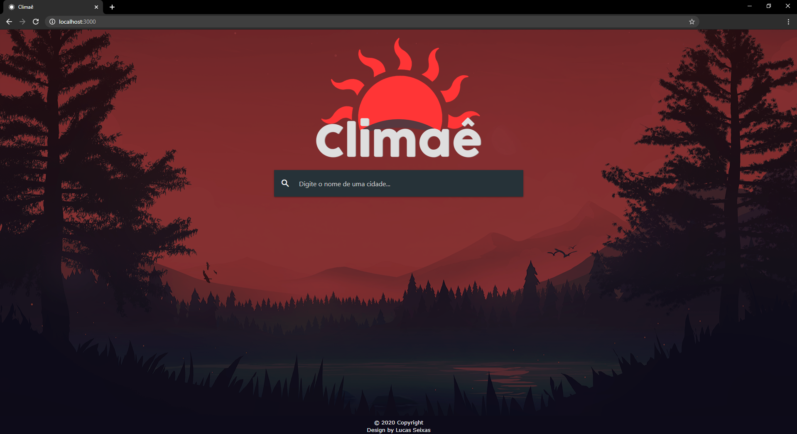
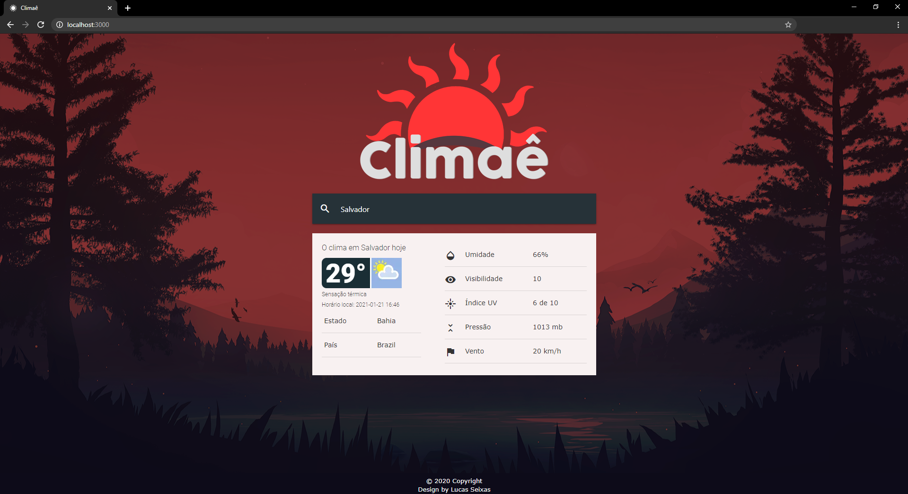
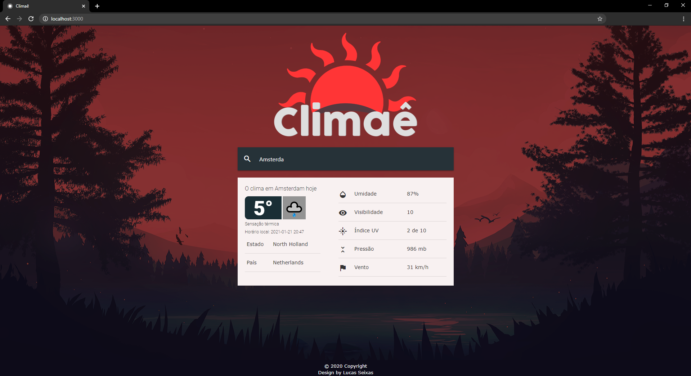
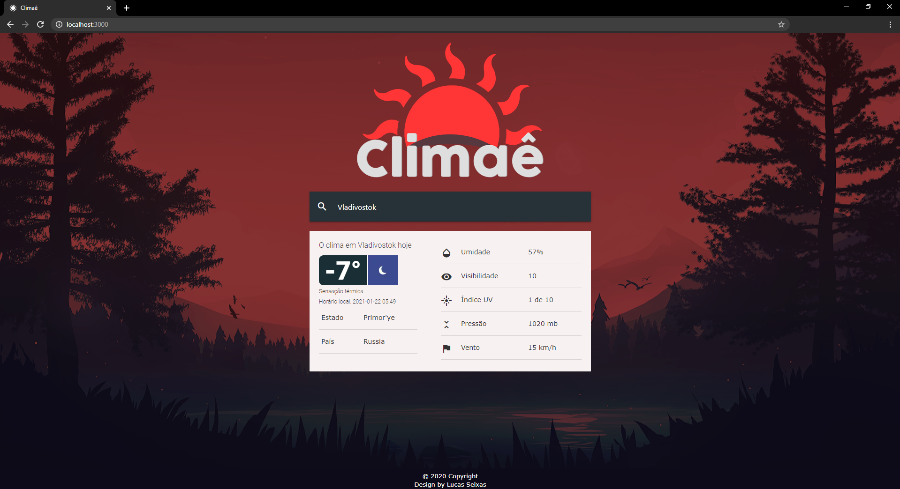

<p align="center">  </p>

Climaê é um projeto em Angular utilizando a API do Weatherstack para visualizar a previsão do tempo. 

# Rodando o Projeto
 
1. Abrir a pasta do projeto no Visual Studio ou no programa de sua prefêrencia.

### Instalando

1. Instalar pacotes do NPM
   ```sh 
    npm install
   ```
   
3. Realizar as preparações necessárias para executar o projeto.
    ```sh 
    npm run build 
    ```

4. Executar o projeto. 
    ```sh
    npm start
    ```
### Visualizando o Projeto

1. Depois de executar todos esses comandos, basta acessar o

   ```sh
   http://localhost:3000/
   ```
2. Ao acessar você será direcinado para a página inicial.


3. Basta digitar o nome de alguma cidade no input que após apertar 'Enter' será feito um request para a [API Weatherstack](https://weatherstack.com/) e ela irá retornar o seguinte:

```sh
{ 
  "request": {
     "type":"City",
     "query":"Salvador",
     "language":"en",
     "unit":"m"
  },
  "location": {
     "name":"Salvador",
     "country":"Brazil",
     "region":"Bahia",
     "lat":"-12.983",
     "lon":"-38.517",
     "timezone_id":"America\/Bahia",
     "localtime":"2021-01-21 16:57",
     "localtime_epoch":1611248220,
     "utc_offset":"-3.0"
  },
  "current": {
     "observation_time":"07:57 PM",
     "temperature":29,
     "weather_code":116,
     "weather_icons":[
       "https:\/\/assets.weatherstack.com\/images\/wsymbols01_png_64\/wsymbol_0002_sunny_intervals.png"
     ],
     "weather_descriptions":[
          "Partly cloudy"
     ],
     "wind_speed":20,
     "wind_degree":100,
     "wind_dir":"E",
     "pressure":1013,
     "precip":0.5,
     "humidity":66,
     "cloudcover":75,
     "feelslike":34,
     "uv_index":6,
     "visibility":10,
     "is_day":"yes"
   }
}
```
4. Após isso, selecionei os itens mais relevantes para mostrar na previsão do tempo e tratei os dados, resultando na seguinte tela: 



Outros exemplos: 




